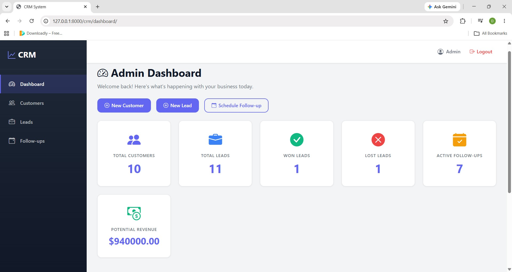
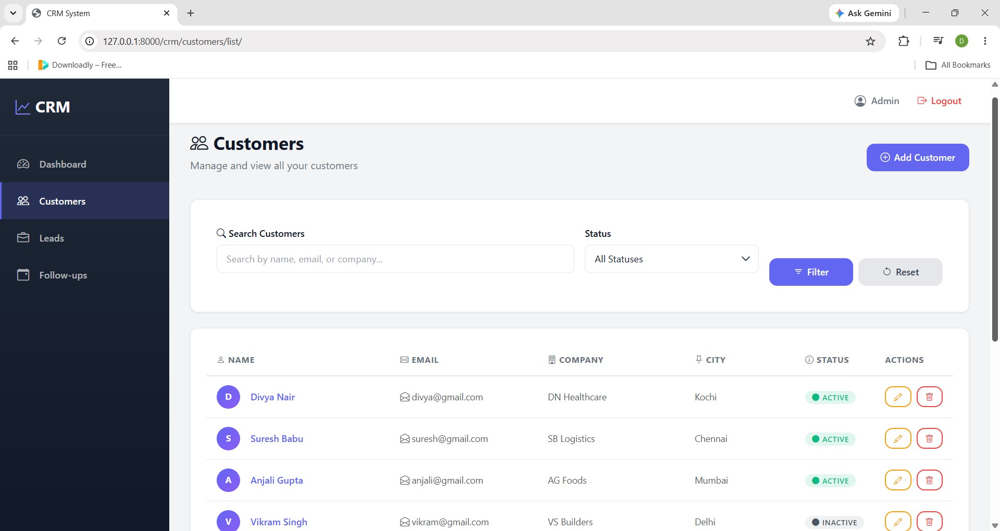
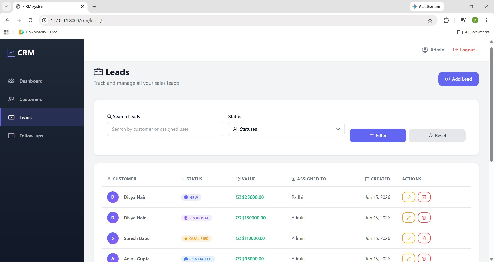
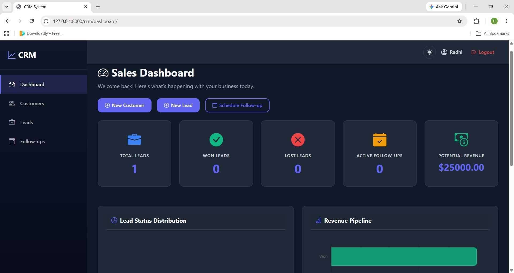
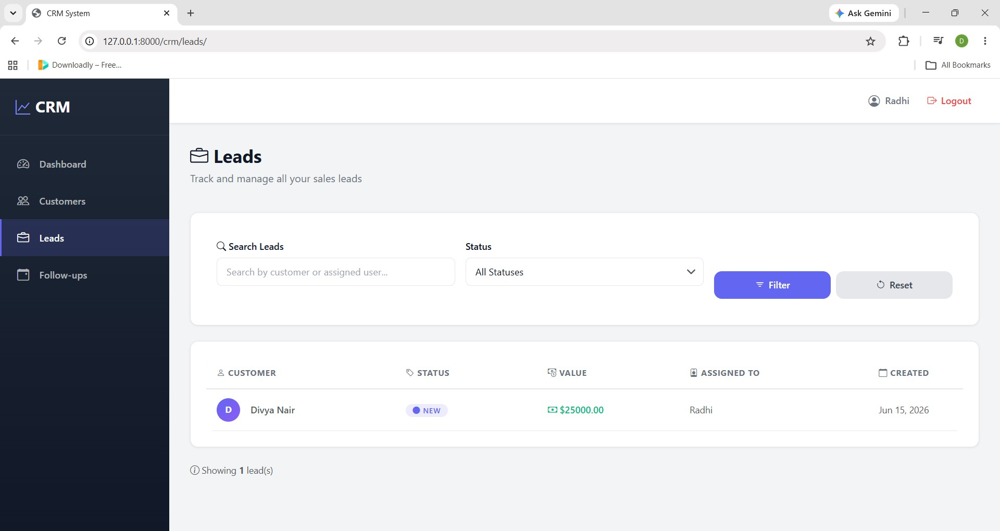
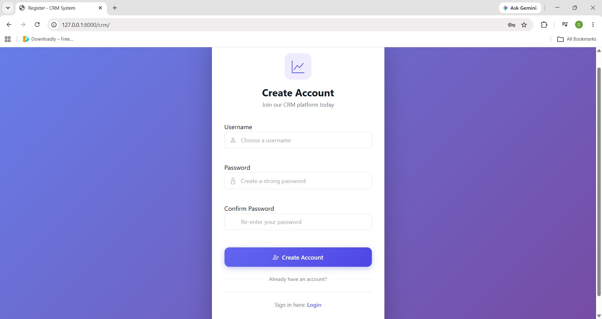
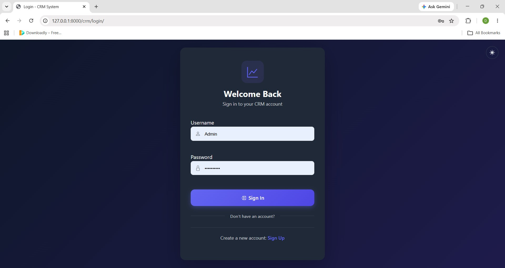

# CRM Management System

A modern, full-featured Customer Relationship Management (CRM) application built with Django and PostgreSQL. Manage customers, leads, and follow-ups efficiently with role-based access control and real-time dashboards.

---

## 🎯 Features

### 🔐 Authentication & Authorization
- User registration and login with secure authentication
- Role-based access control (Admin and Sales Executive)
- JWT token-based API authentication
- Modern, responsive login/register pages

### 👥 Customer Management
- Add, view, update, and delete customer records
- Detailed customer profiles with contact information
- Customer status tracking (Active/Inactive)
- Search customers by name, email, or phone
- Comprehensive customer history and linked activities

### 📊 Lead Management
- Create and manage sales leads linked to customers
- Assign leads to team members
- Track lead progress through sales pipeline
- Lead statuses: New, Contacted, Qualified, Proposal Sent, Won, Lost
- Expected value tracking for revenue forecasting
- Real-time lead status updates

### ✅ Follow-Up Management
- Schedule follow-up tasks for leads
- Add detailed notes to follow-ups
- Mark follow-ups as completed
- Track pending follow-ups for accountability

### 📈 Dashboard & Analytics
- Real-time business metrics dashboard
- Admin dashboard: system-wide overview
- User dashboard: personal performance tracking
- Metrics include:
  - Total customers and leads count
  - Won/lost lead analytics
  - Active follow-ups tracking
  - Potential revenue calculation

### 🔌 REST API
- Full RESTful API endpoints with authentication
- Customer and lead API resources
- Advanced filtering and searching
- Token-based authentication

---

## 💻 Technology Stack

| Category | Technology |
|----------|-----------|
| **Backend** | Python, Django 4.x |
| **Database** | PostgreSQL |
| **API** | Django REST Framework |
| **Authentication** | Django Sessions & JWT API Auth |
| **Frontend** | Pure HTML, CSS, Bootstrap 5 |
| **Filtering** | Standard HTML GET Forms & Django ORM |

---

## 📸 Screenshots

<p align="center">
  
  
  
  
  
  
  
</p>

---

## 🚀 Getting Started

### Prerequisites
- **Python** 3.8 or higher
- **PostgreSQL** installed and running
- **Git**

### Installation Steps

1. **Clone the repository**
   ```bash
   git clone https://github.com/yourusername/crm_project.git
   cd crm_project
   ```

2. **Create and activate a virtual environment**
   ```bash
   python -m venv venv
   # On Windows
   venv\Scripts\activate
   # On macOS/Linux
   source venv/bin/activate
   ```

3. **Install dependencies**
   ```bash
   pip install -r requirements.txt
   ```

4. **Set up Environment Variables**
   This project uses `python-decouple` for managing environment variables. Create a `.env` file in the root directory (next to `manage.py`) and add your database and security credentials:
   ```env
   SECRET_KEY=your_django_secret_key_here
   DEBUG=True
   DB_NAME=your_database_name
   DB_USER=your_database_user
   DB_PASSWORD=your_database_password
   DB_HOST=localhost
   DB_PORT=5432
   ```

5. **Apply Database Migrations**
   ```bash
   python manage.py makemigrations
   python manage.py migrate
   ```

6. **Create a Superuser (Admin Account)**
   ```bash
   python manage.py createsuperuser
   ```

7. **Run the Development Server**
   ```bash
   python manage.py runserver
   ```
   The application will be available at `http://127.0.0.1:8000/`.

---

## 🔌 API Endpoints

All API endpoints require JWT authentication.

### Authentication
```http
POST   /api/token/           # Obtain JWT token
POST   /api/token/refresh/   # Refresh JWT token
```

### Customers
```http
GET    /api/customers/            # List all customers (with search/filter)
POST   /api/customers/            # Create a new customer
GET    /api/customers/{id}/       # Get customer details
PUT    /api/customers/{id}/       # Update customer
DELETE /api/customers/{id}/       # Delete customer
```

### Leads
```http
GET    /api/leads/                # List all leads (with search/filter)
POST   /api/leads/                # Create a new lead
GET    /api/leads/{id}/           # Get lead details
PUT    /api/leads/{id}/           # Update lead status
DELETE /api/leads/{id}/           # Delete lead
```

---
   
## 👤 User Roles & Permissions

### Admin (Superuser)
- View all customers and leads
- Create, update, and delete any customer
- View system-wide dashboard with all metrics
- Assign leads to team members
- Manage all follow-ups

### Sales Executive (Regular User)
- View only assigned leads
- Create and manage customers
- Update status of assigned leads
- View personal dashboard
- Manage their own follow-ups

---

## 📖 Usage 

### Creating a Customer
1. Login to the application
2. Navigate to **Customers** → **Add Customer**
3. Fill in customer details (name, email, phone, company, city)
4. Set status (Active/Inactive)
5. Click **Save**

### Creating a Lead
1. Go to **Leads** → **Add Lead**
2. Select the customer associated with the lead
3. Assign the lead to a team member (admin only)
4. Set initial status (New)
5. Enter expected deal value
6. Click **Save**

### Tracking Lead Progress
1. Go to **Leads** → **Lead List**
2. Click on a lead to view details
3. Update status through the sales pipeline
4. Track all changes and activities

### Scheduling Follow-ups
1. Navigate to **Follow-ups** → **Add Follow-up**
2. Select the lead to follow up
3. Set follow-up date and add detailed notes
4. Click **Save**
5. Mark as completed when done

### Viewing Dashboard
1. Click on **Dashboard** from navigation
2. View personalized metrics (for sales executives)
3. Admin sees system-wide metrics
4. Track key performance indicators

---

## 🧠 What I Learned

Through this project, I gained hands-on experience with:

- **Django Framework**: Models, Views, Templates, ORM
- **Database Design**: PostgreSQL integration and normalization
- **REST APIs**: Building scalable API endpoints
- **Authentication**: Implementing JWT token authentication
- **Authorization**: Role-based access control (RBAC)
- **Frontend Development**: Bootstrap 5, HTML, CSS
- **Django Admin**: Customizing admin interface
- **Git Workflow**: Version control best practices

---

